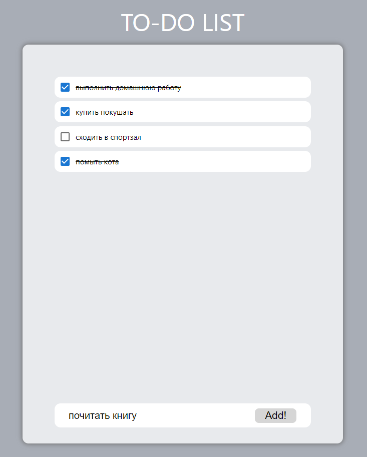

# Make a todo List!
## Type your "todo" into input field and click "Add!" button. Your task will appear at the top. You can add more tasks (as much as you want), you can mark as done and also undone it if you want.  But it has no database so when you refresh, tasks will disapear.

 

## Напишите задачу в поле снизу и кликните на кнопку "Add!". Ваша "задачка" появится сверху, вы можете добавлять их сколько угодно. Также предусмотрена кнопка, которая пометит задачу как выполненную, или опять же отменить выполнение, кликнув еще раз. У приложения нет базы данных, поэтому при перезагрузке страницы все "задачки" исчезнут.

 

### Follow this link to check this app: / Приложение доступно по ссылке: [Todo-App](https://gamza222.github.io/Todo-App/)

